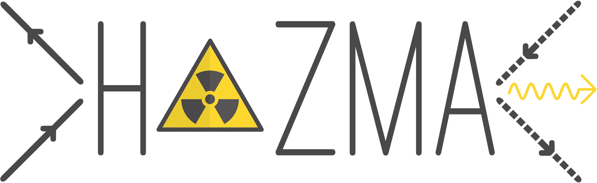

Icon made by Freepik from www.flaticon.com (Logo designed by David Reiman and Adam Coogan)

# Hazma
Gamma ray spectrum generator for light standard model particles.

For more information, visit https://loganamorrison.github.io/Hazma/
